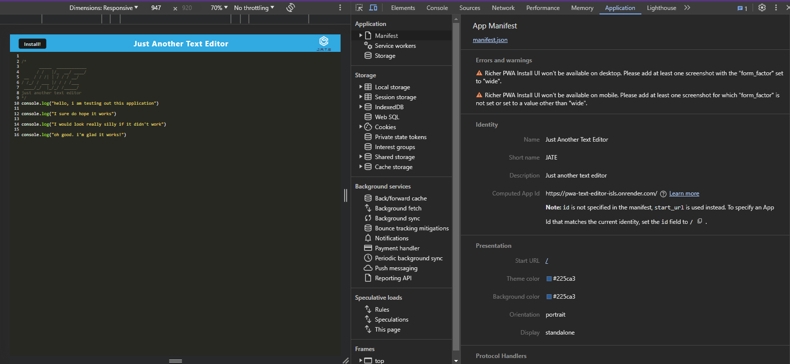
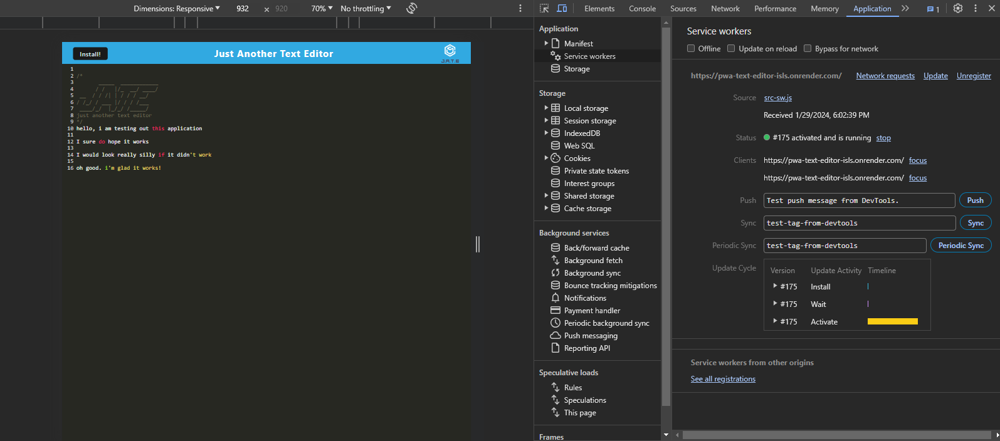
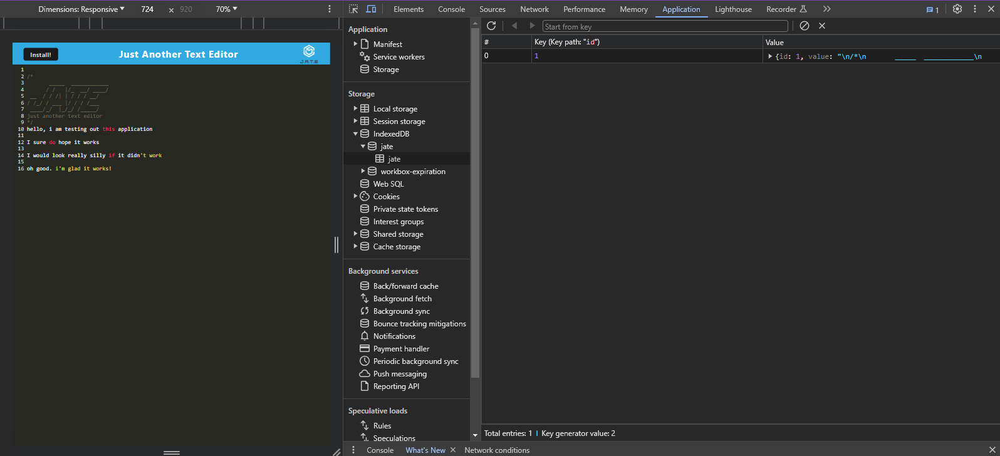

## pwa-text-editor

## User Story
```
AS A developer
I WANT to create notes or code snippets with or without an internet connection
SO THAT I can reliably retrieve them for later use
```

## Acceptance Criteria
```
GIVEN a text editor web application
WHEN I open my application in my editor
THEN I should see a client server folder structure
WHEN I run `npm run start` from the root directory
THEN I find that my application should start up the backend and serve the client
WHEN I run the text editor application from my terminal
THEN I find that my JavaScript files have been bundled using webpack
WHEN I run my webpack plugins
THEN I find that I have a generated HTML file, service worker, and a manifest file
WHEN I use next-gen JavaScript in my application
THEN I find that the text editor still functions in the browser without errors
WHEN I open the text editor
THEN I find that IndexedDB has immediately created a database storage
WHEN I enter content and subsequently click off of the DOM window
THEN I find that the content in the text editor has been saved with IndexedDB
WHEN I reopen the text editor after closing it
THEN I find that the content in the text editor has been retrieved from our IndexedDB
WHEN I click on the Install button
THEN I download my web application as an icon on my desktop
WHEN I load my web application
THEN I should have a registered service worker using workbox
WHEN I register a service worker
THEN I should have my static assets pre cached upon loading along with subsequent pages and static assets
WHEN I deploy to Render
THEN I should have proper build scripts for a webpack application
```

## Table of Contents
- [Description](#description)
- [Technologies](#technologies)
- [Links](#links)
- [Installation](#installation)
- [Usage](#usage)
- [Images](#images)
- [Questions](#questions)

## Description
This web text editor enables users to create notes or code snippets seamlessly, with or without an internet connection. Leveraging integrated service workers and the Cache API, the application guarantees full functionality even offline. Users can confidently access previously visited pages regardless of internet availability, ensuring reliability in retrieving their content for future use.

## Technologies
- Node.js
- Express
- Webpack (Webpack, webpack-dev-server, WebpackPwaManifest)
- Babel
- CSS-Loader
- Concurrently
- IndexedDB

## Links
[Deployment Link](https://pwa-text-editor-isls.onrender.com)

## Installation
open in intergrated terminal and install the following packages:
 ```
npm install express
npm install --save-dev webpack
npm install webpack-dev-server --save-dev
npm install --save-dev webpack-pwa-manifest
npm install babel
npm install --save-dev css-loader
npm install concurrently --save
npm npm install idb
```

##  Usage
After running the project, enter the following code in the client folder:

```
npm run build
```

Follow up by entering the following code to start the application:

```
npm run start:dev
```

## Images
The following animation demonstrates the application functionality:


The following image shows the application's `manifest.json` file:


The following image shows the application's registered service worker:


The following image shows the application's IndexedDB storage:


## Questions
If you have any addition questions feel free to reach me at either my github or email address.
- [GitHub](https://github.com/allexortiz)
- [Email](allex.ortiz@outlook.com)